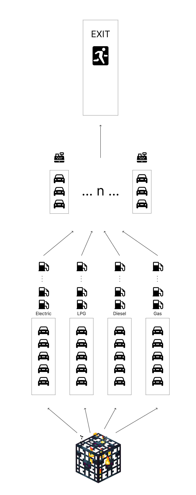
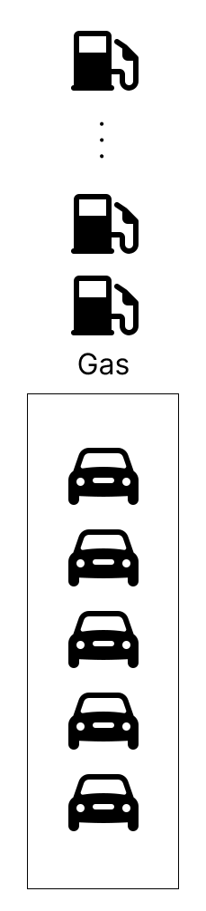
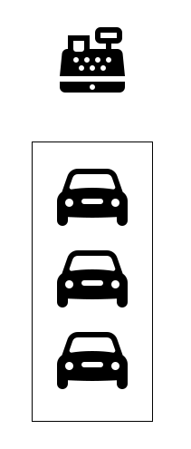

# Gas Station simulator in Golang

## Main components

### Pump Line

A gas station has multiple pump lines depending on the types of fuels
it sells. If a gas station sells gas, diesel and electric, it will have
three pump lines, period. These pump lines have an arbitrary amount of pumps.
It can be a set of the same type of pumps or a mix of different types (two pumps can 
differ in a name and the speed of fueling - i.e. normal EV charger vs a Tesla Supercharger).

### Cash Register

